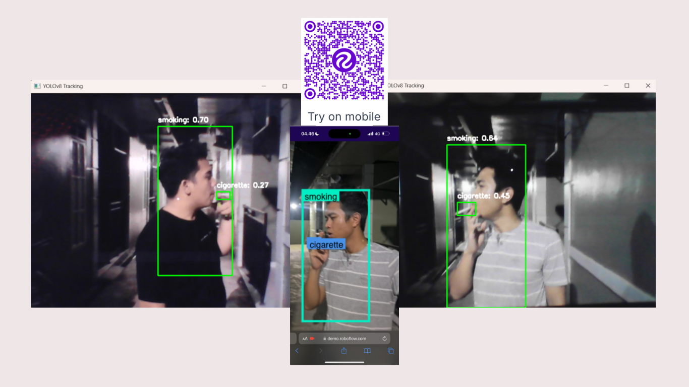

### APP


# Smoking Detection 🚭

This project implements a real-time smoking detection system using **YOLOv8** and **OpenCV**. It is designed to detect individuals smoking in video streams or live camera feeds, making it suitable for environments where smoking is prohibited.

---

## 🚀 Features
- **Real-Time Detection**: Detects smoking behavior instantly in video feeds.
- **High Accuracy**: Utilizes the YOLOv8 object detection model for precise detection.
- **Customizable**: Can be trained on custom datasets for specific environments.

---

## 🛠️ Installation and Setup

1. **Clone the Repository**
   ```bash
   git clone https://github.com/Riswaldy/smoking-detection.git
   cd smoking-detection
   
pip install -r requirements.txt
yolo task=detect mode=train data=data.yaml model=yolov8n.pt epochs=50 imgsz=640
python main.py

## 💡Credits
**Developed by Riswaldy.**
**Special thanks to open-source tools like YOLO and OpenCV.**


